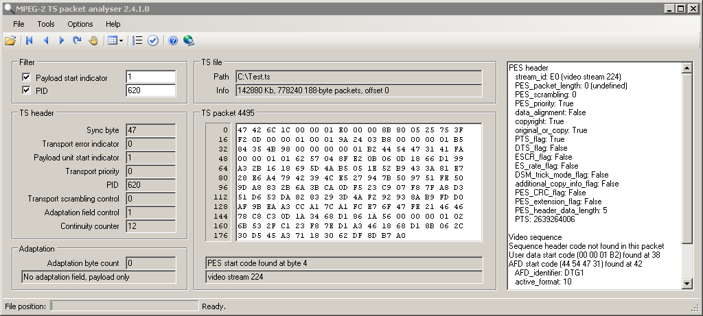

# MPEG-2 Transport Stream Packet Analyser
MPEG-2 Transport Stream packet analyser enables decoding and low level analysis of ISO/DVB/AVCHD transport streams. It can be used for fault-finding, equipment and system testing, software development and learning about how digital television systems work.

* Open MPEG-2 transport streams from digital satellite, cable and terrestrial TV broadcasts.
* Open AVCHD and Bluray transport streams.
* No installation required, just un-zip and run. Requires .NET 4 framework which is a free download available from Microsoft

## Decode and View

* Open MPEG-2 transport stream files (188,192,204,208 byte packets)
* Open a single transport stream packet
* Open MPEG-2, AVCHD, and Bluray transport streams (ts, trp, m2t, m2ts)
* Display packet bytes as hex or ascii
* Navigate through the stream, filter on PID and/or payload start flag
* Decode Transport Stream headers and adaptation data including PCR
* Decode Packetised Elementary Stream headers and stream types including PTS/DTS
* Decode MPEG-2 and DVB table headers; PAT, PMT, NIT, BAT, SDT, EIT, TDT, TOT
* Decode MPEG-2 video sequence headers; picture size, aspect ratio and frame rate
* Decode Active Format Descriptors (AFD) as defined by the DTG D-Book
* Decode Audio Description (AD) pan and fade values and export to CSV
* Decode PAT, program numbers and program map PIDs
* Decode TDT, TOT, current date and time
* [Manually add PIDs for PMT decoding](screenshots/section_pids.png) using the Table PID list menu
* [Analyse packet spacing](screenshots/pidspacing.png)
* Check TS packet continuity count compliance on a single PID or the entire stream (ETR 101 290)
* Check TS sync bytes are present and correct (ETR 101 290)

## Export and Report
* [De-multiplex](screenshots/demux.png) transport streams
* [Trim](screenshots/demux.png) transport streams
* Convert from 192,204,208 byte streams to a 188 byte stream
* [Generate a PID usage report](screenshots/pidlist.png) and save as CSV
* [Generate custom CSV reports](screenshots/report.png); TS packet header data, adaptation fields, PES headers, PCR, PTS/DTS, TDT/TOT, table headers, AR, AFD, picture type, GOP structure, Audio Description and more...
* [Generate detailed table reports](screenshots/tables_report.png); table id, sub table id, section length, packet spacing...

## Links and references
MPEG-2 Transport stream analyser is compliant with the following international standards.

* ISO/IEC 13818-1, Generic coding of moving pictures and associated audio information: Systems
* ISO/IEC 13818-2, Generic coding of moving pictures and associated audio information: Video
* DVB ETSI EN 300 468, Specification for Service Information (SI)
* DTG D-Book, Digital Terrestrial Television Requirements for Interoperability
